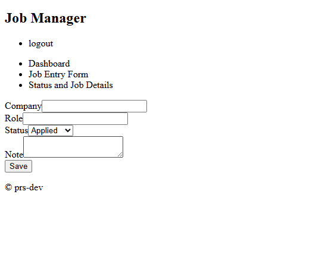
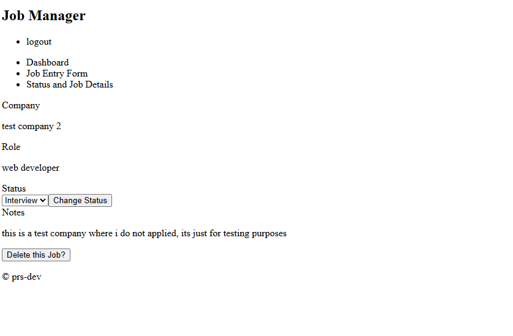

## my personal project -- An AI job assistant

Features:
* user can register using name, email, and password (duplicate users are not allowed)
* users will be presented with dashboard where all stats are shown (to be implemented)
* user will have a entry form to enter the details of new job
* user can see all jobs and the status of it on details page

Features to include:
* tailwind and shadcn for UI styling
* bug fixes

