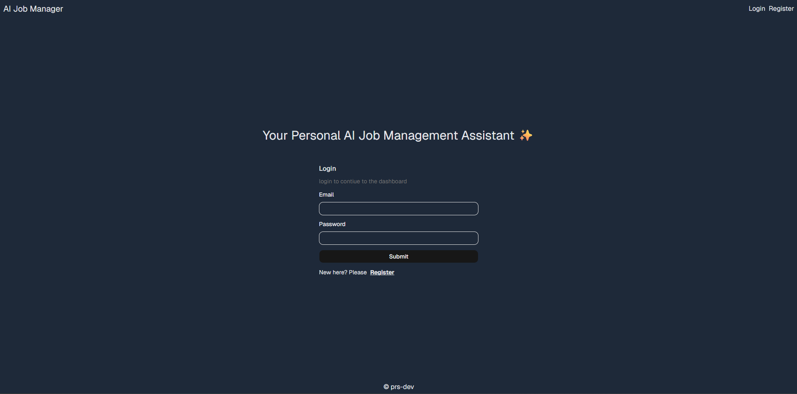
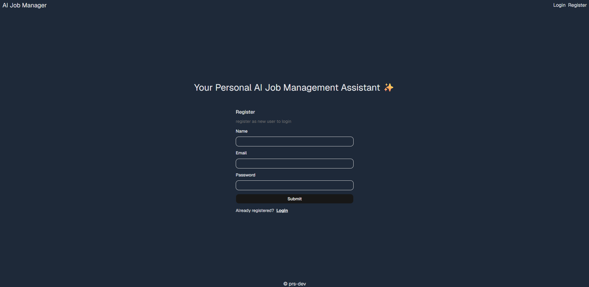
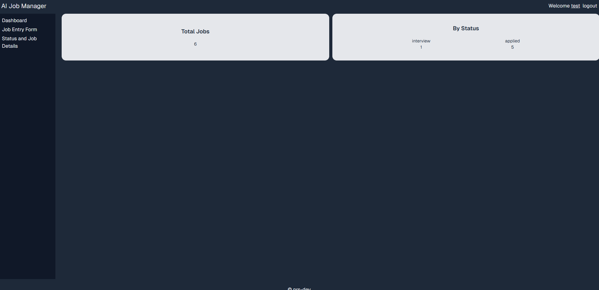
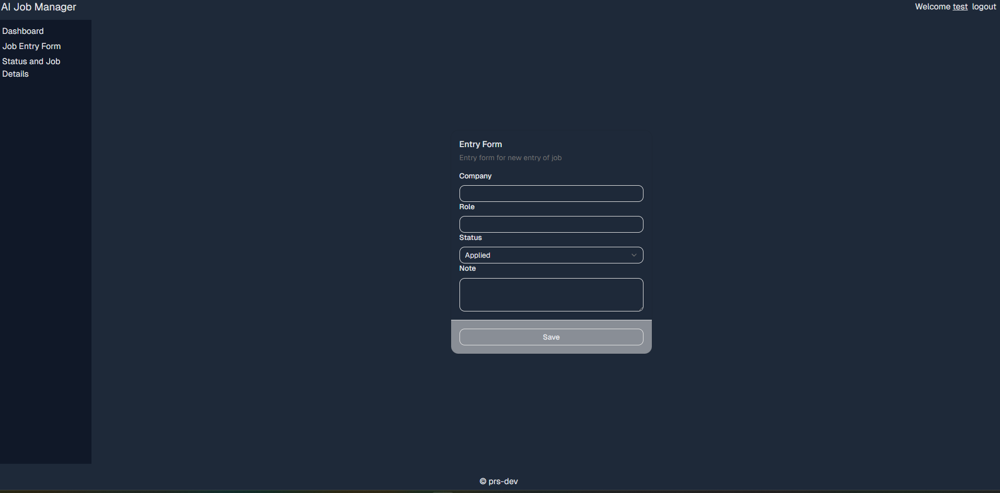
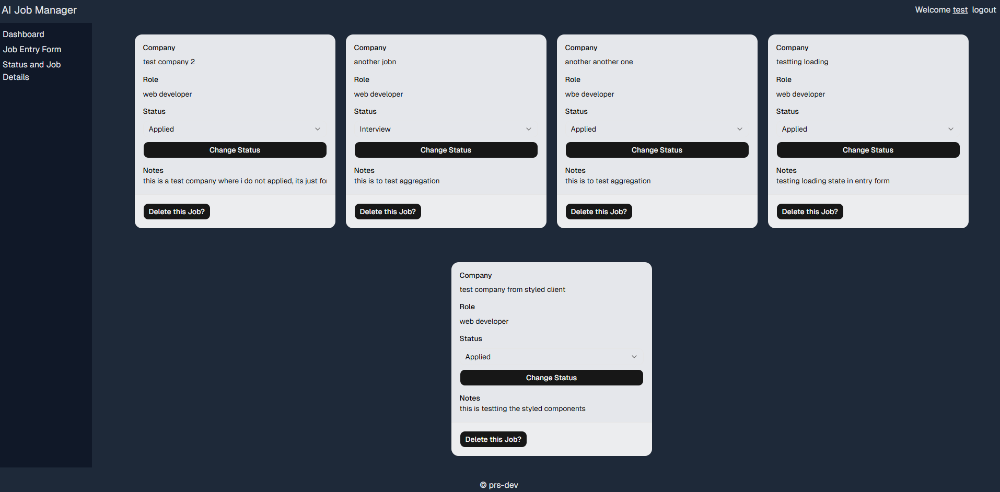
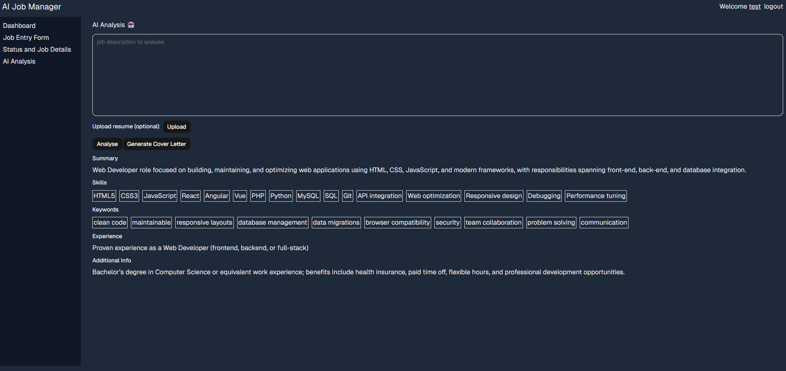
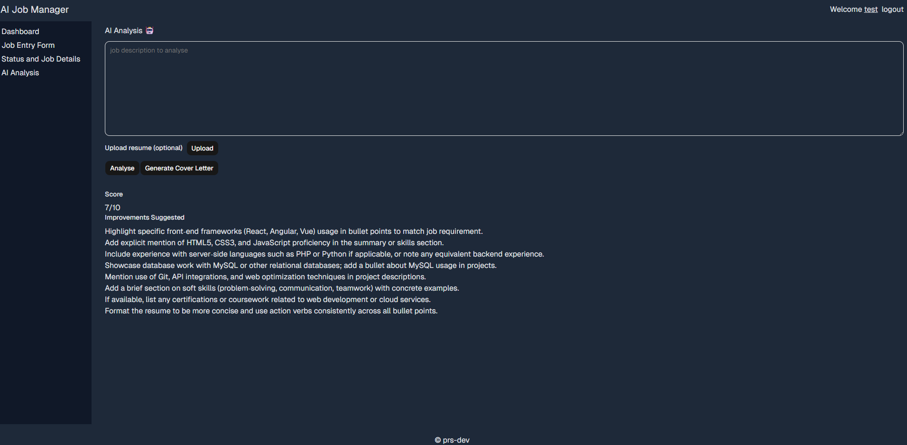

## my personal project -- An AI job assistant

Features:
* user can register using name, email, and password (duplicate users are not allowed)
* users will be presented with dashboard where all stats are shown (to be implemented)
* user will have a entry form to enter the details of new job
* user can see all jobs and the status of it on details page
* UI styled using tailwind and shadcn
* User can use AI features (mainly three):
    * Analyse -- In analyse, AI will analyse the job description and based on that gives summary, keywords, skills and additional info based on the job
    * Generate Cover letter -- AI will generate a general cover letter than can be used to apply for the job
    * Analyse and compare -- In this, AI will compare resume with job description and provide with score (out of 10) and improvements for resume

Features to include:
* bug fixes

Login -- 
Register -- 
Dashboard -- 
Entry Form -- 
Job Detail Page -- 

AI analysis page:
Analyse -- 
Analyse and compare with resume -- 